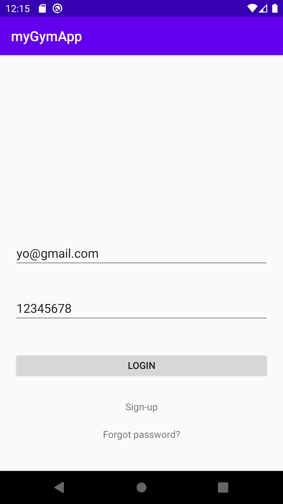
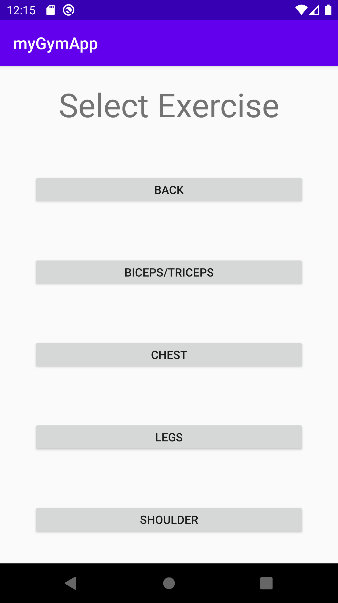
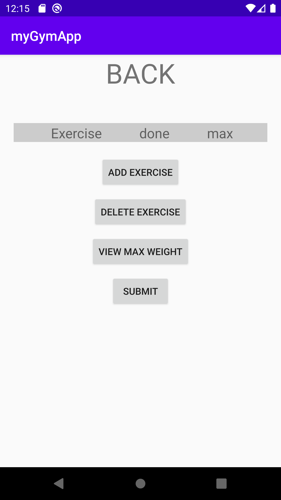
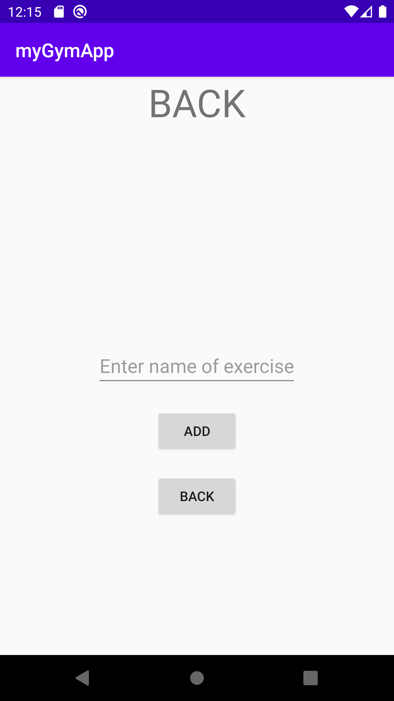
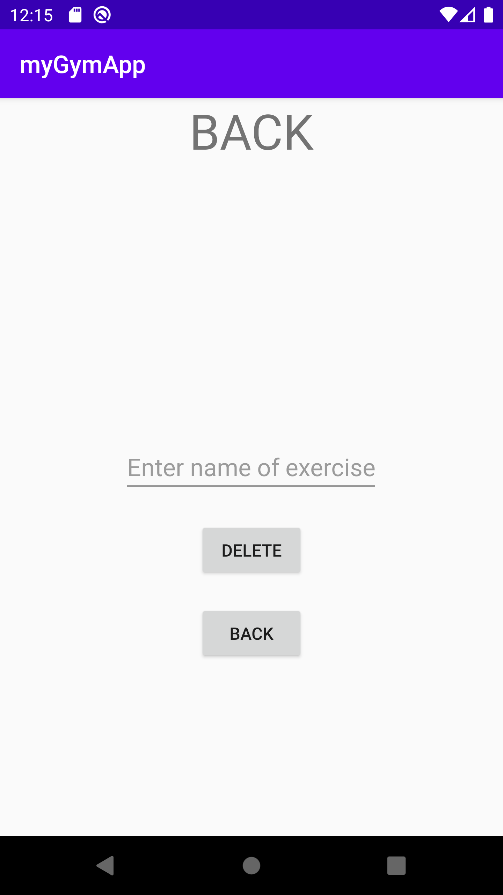
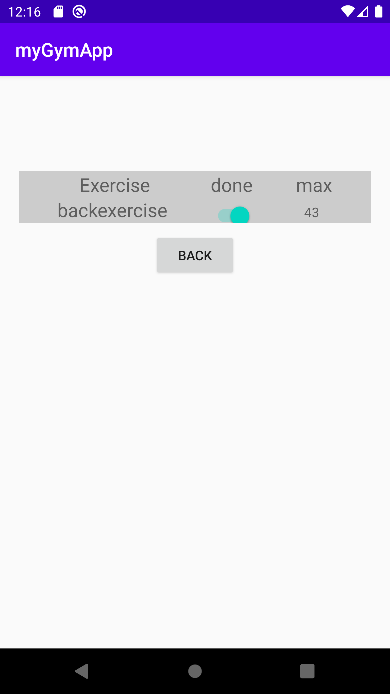

# This is my project on Max-weight management app.
### Short Intro:
* In this app you can add your own exercise and after adding exercise you can enter your max weight that you have lifted. 
* After submit you can view your max-weight by clicking "VIEW MAX WEIGHT" button.
* You can also delete a perticular exercise if you want.

### Technology used :
* java
* XML

### Database used :
* Firebase Database

### Screenshorts : 

   
 

  

  
 

 

  
 

 

  
 

 

  
 

 

  
 

 
