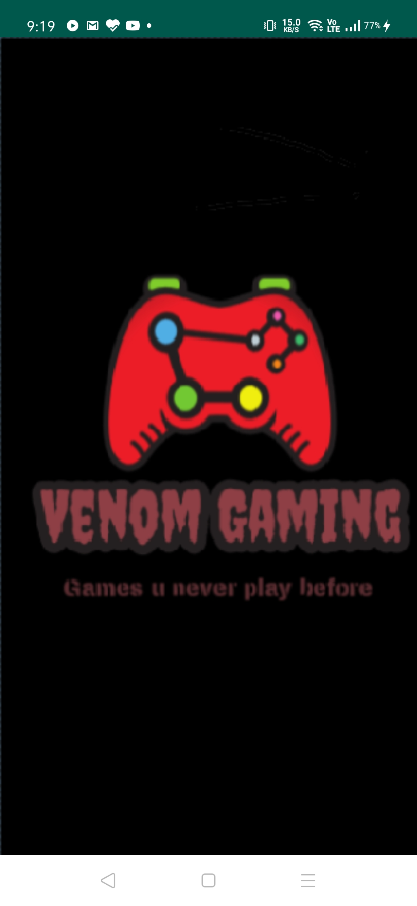
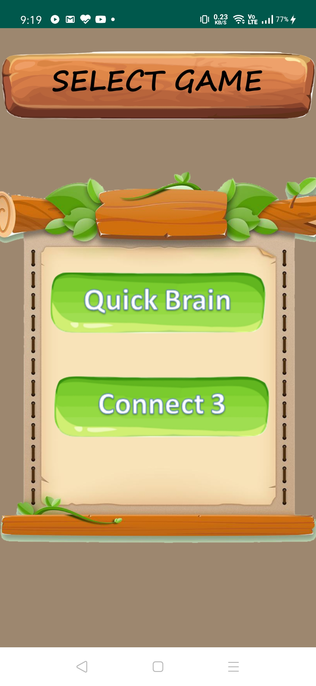
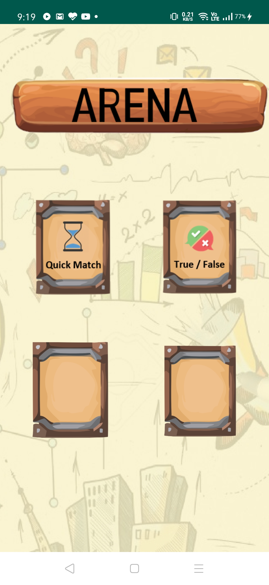
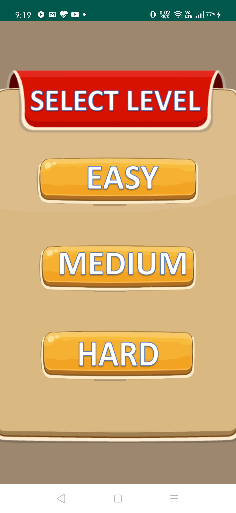
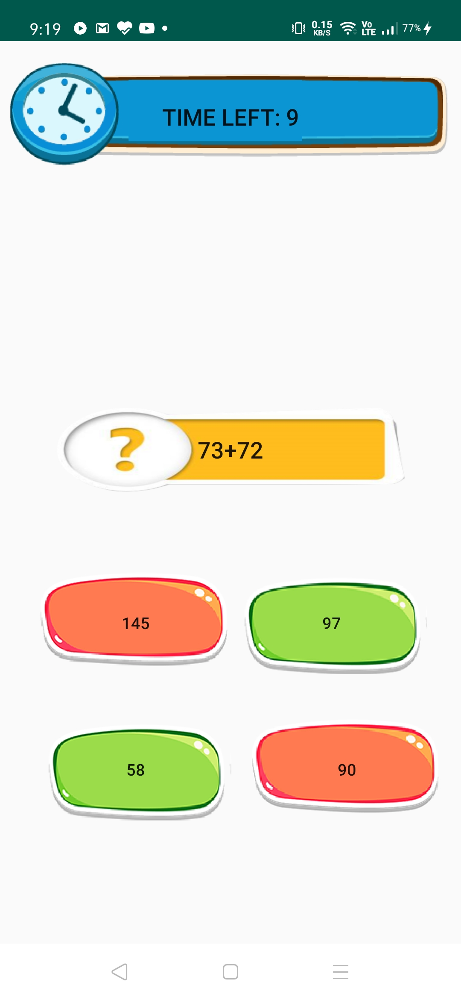
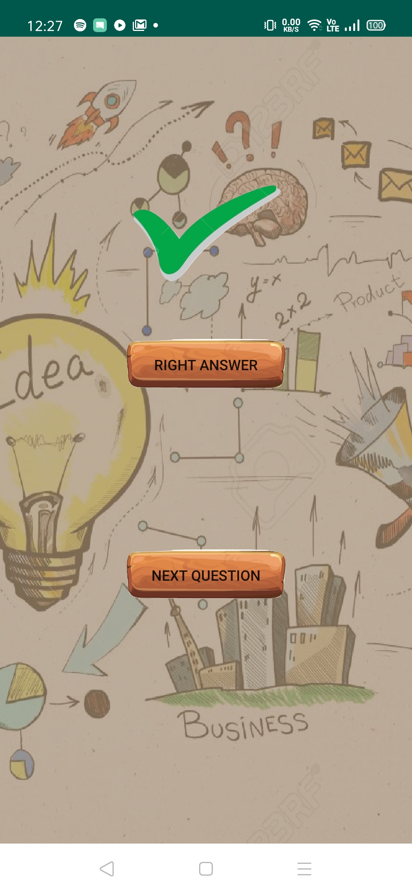
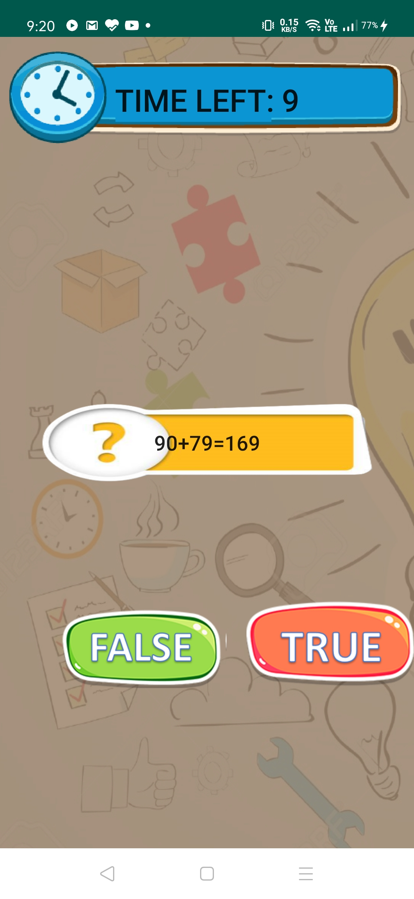
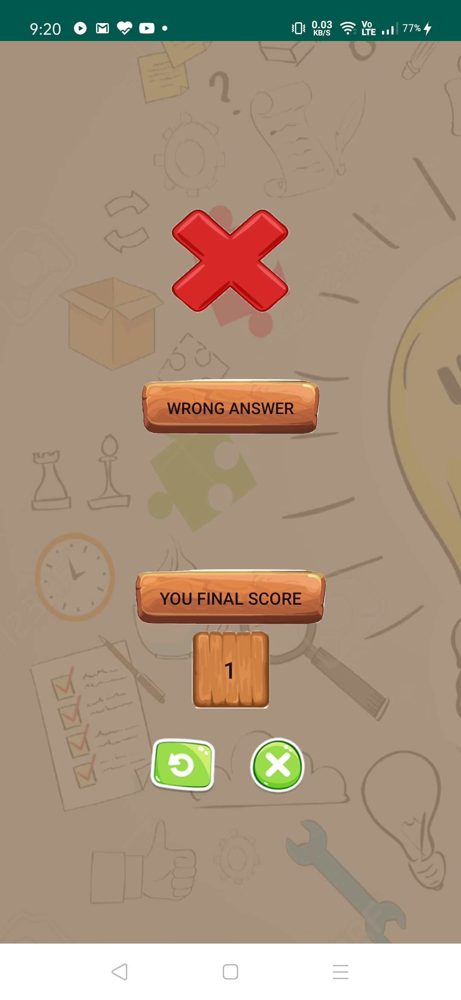
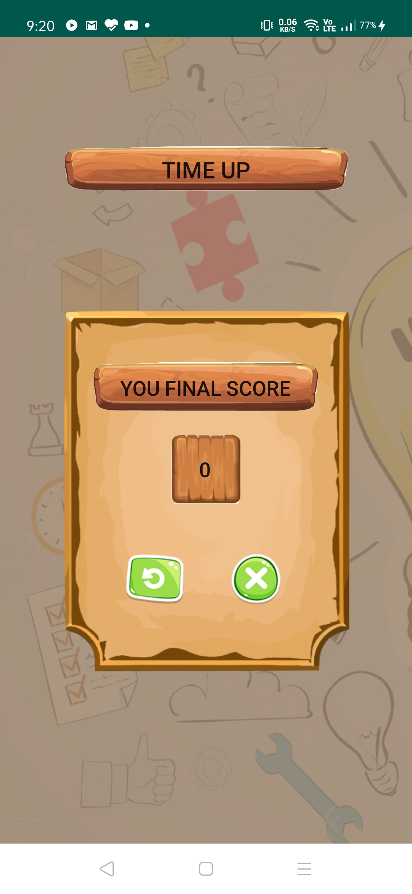

# This is my project on a simple game App.
### Short intro :
In this there are two games: 
(i) Quick Brain  
(ii) Connect 3  
* In quick brain there are two modes by which you can play game.  
1. By choosing correct answer from 4 option.  
2. By answering true/false for given problem.
###### Note:There is time limit in each mode and if your time is up the game is over and it will show your final result.
* Connect 3 is a basic game which ends when one of the players connects 3 dots of the same colors.  
### Technology used:
* java
* XML
### Screenshorts:
 

   
 

  

  
 

 

  
 

 

  
 

 

  
 

 

  
 

 

  
 

 

  
 

 

  
 

 

  
 

 

  
 

