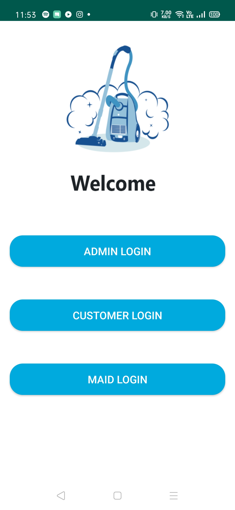
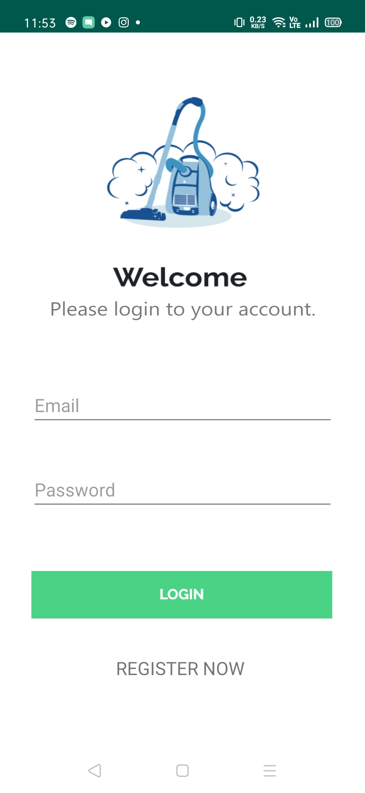
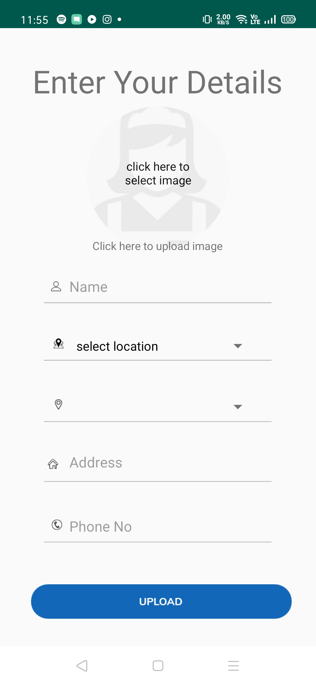
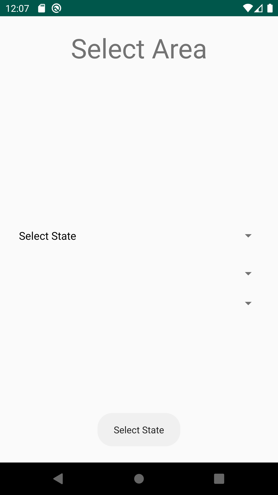
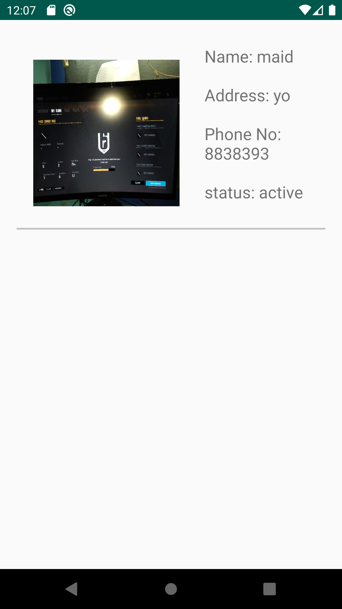
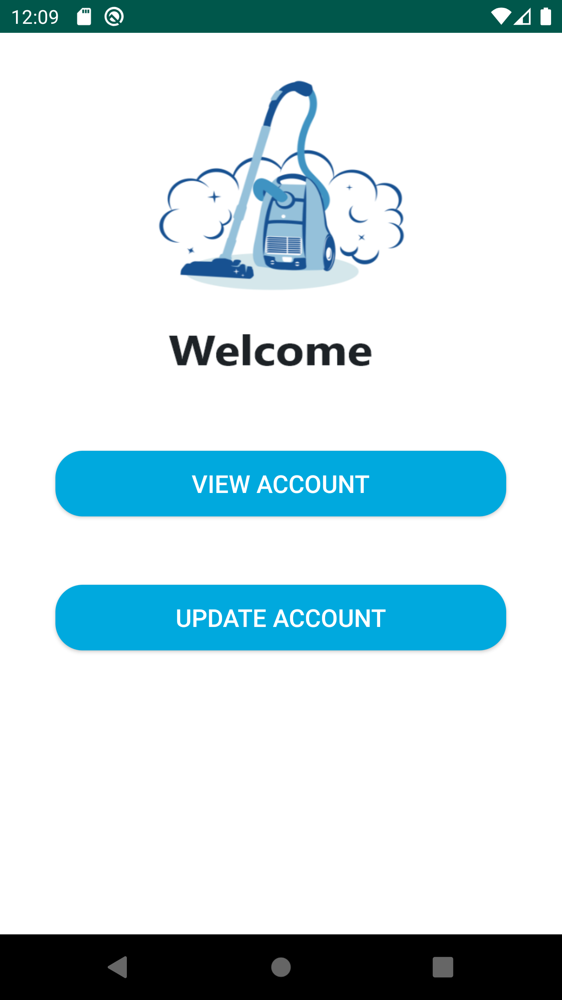

# This is my project on maid hiring App.
### Short Intro:
This app work in 3 ways:   
(i) Admin can login and can add maid.  
(ii) Costumer can signup or login to view maid by selecting area available.  
(iii) Maid can login and can view or update there account.(can update only availability i.e if she/he is available or active).
###### Note: only admin can add maid.

### Technology used :
* java
* XML

### Database used :
* Firebase Databaase

### Screenshorts :

   
 

  

  
 

 

  
 

 

  
 

 

  
 

 

  
 

 

  
 

