# This is project on weight management app
### Short intro:
* In this app you can manage your maximum weight you have lifted on a perticular days.
* just select exercise on Training Plan tab and add exercise.
* after that just add your maximum-weight of that perticular exercise.
* you can view your stats on stats tab.
* there are 2 ways you can view your stats  
 (i) : By days  
 (ii) : By viewing graph.
 * you can login using your e-mail or g-mail or facebook.
 ### Technology used:
 * java
 * XML
 
 ### Database used:
 * Firebase Database
 
 ### Screenshorts:
 
 
 
 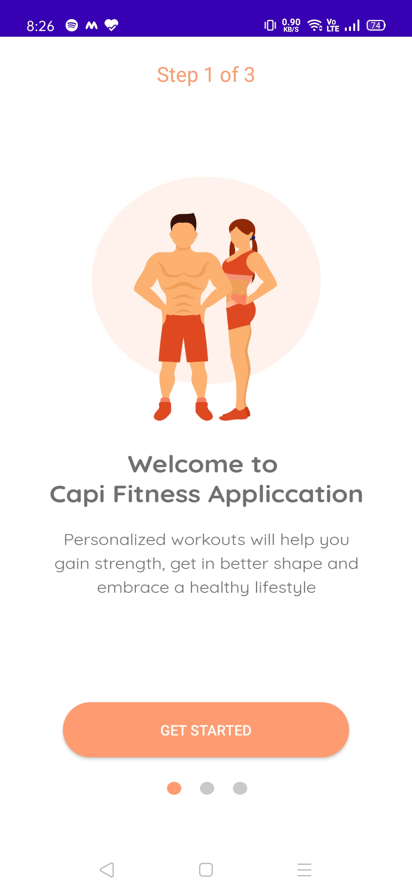
 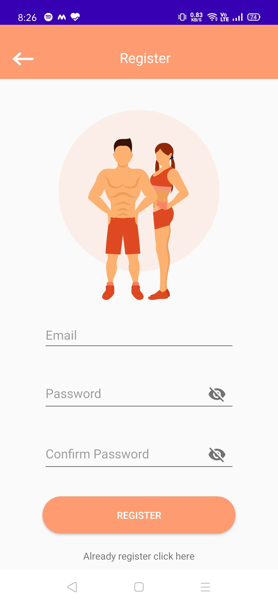
 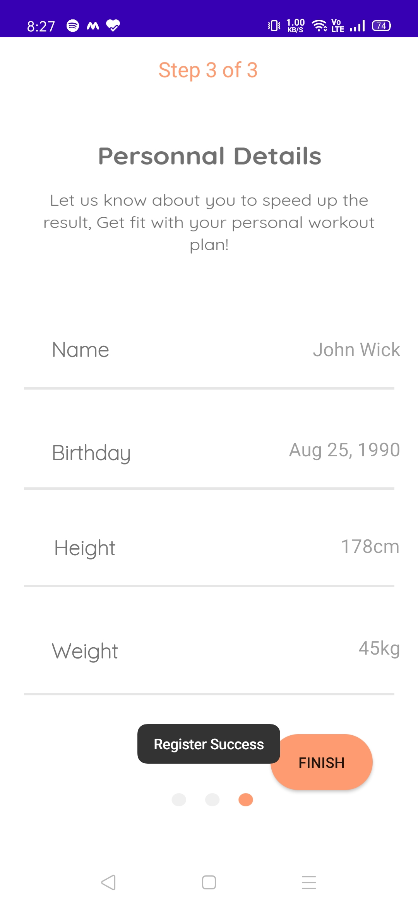
 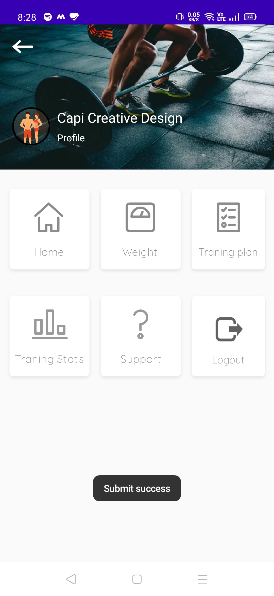
 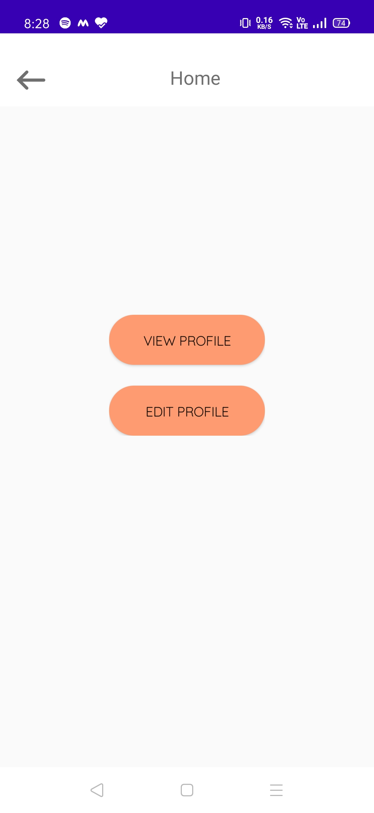
 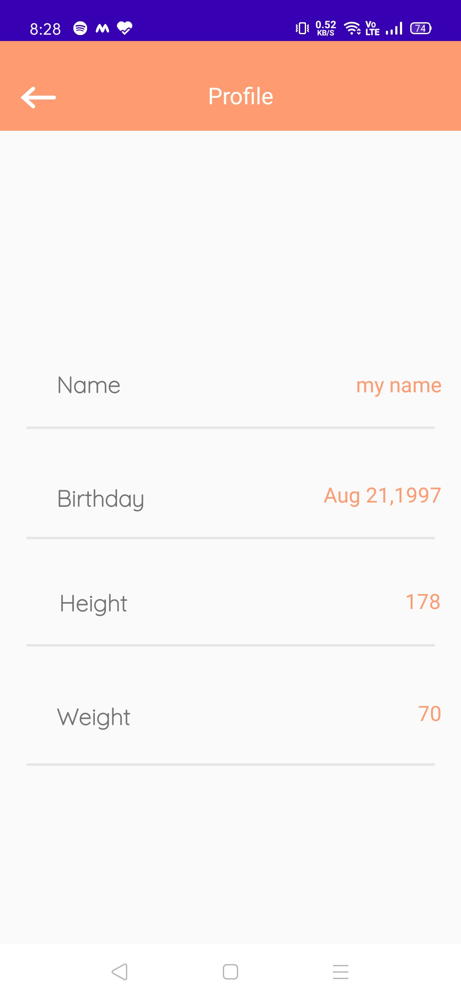
 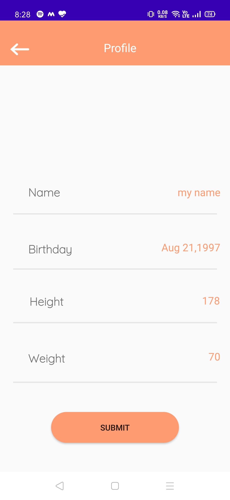
 
 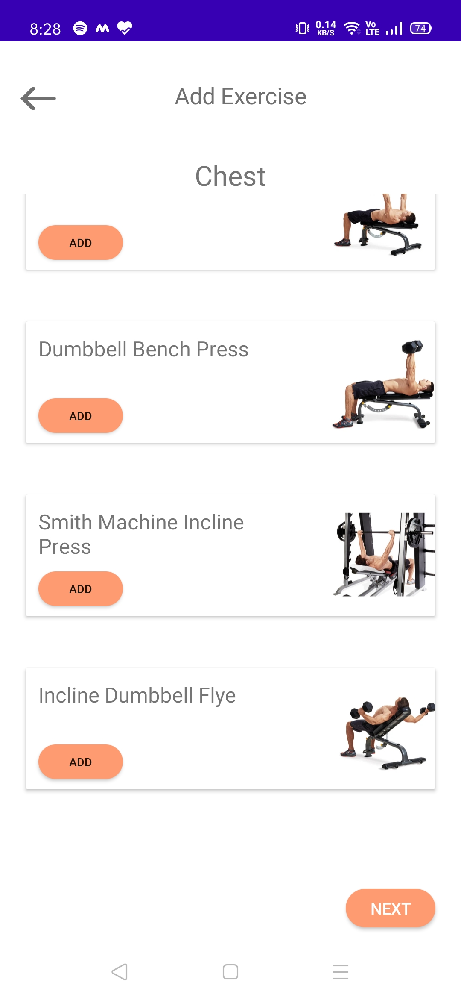
 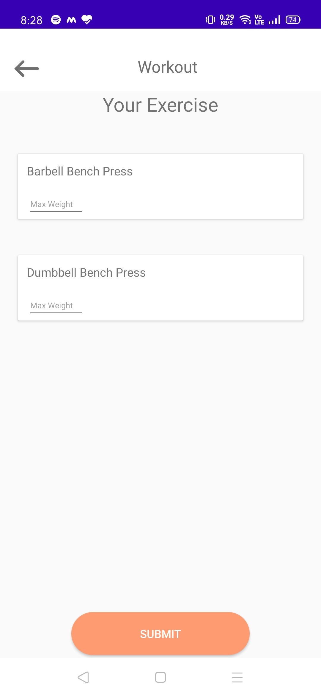
 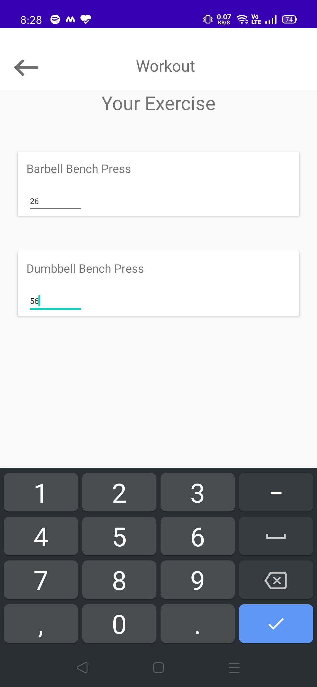
 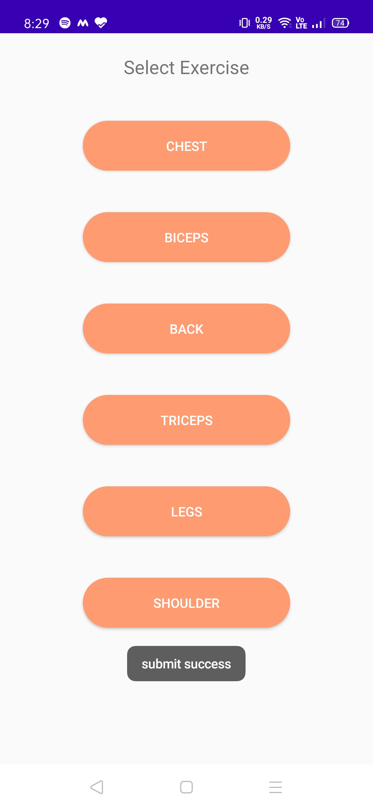
 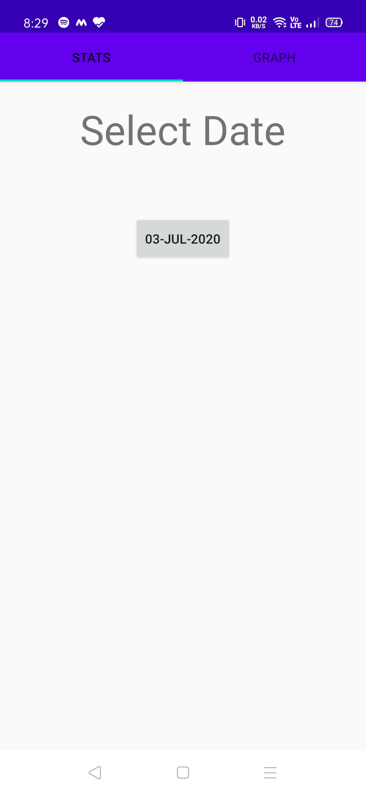
 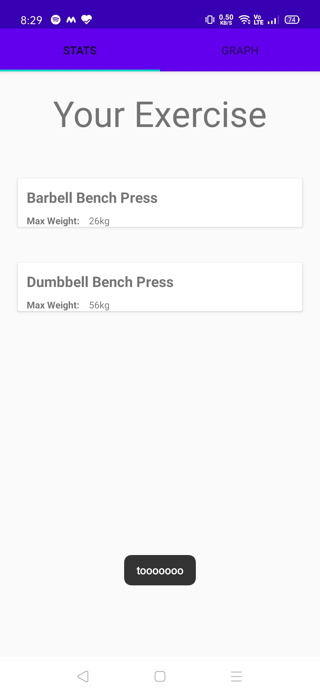
 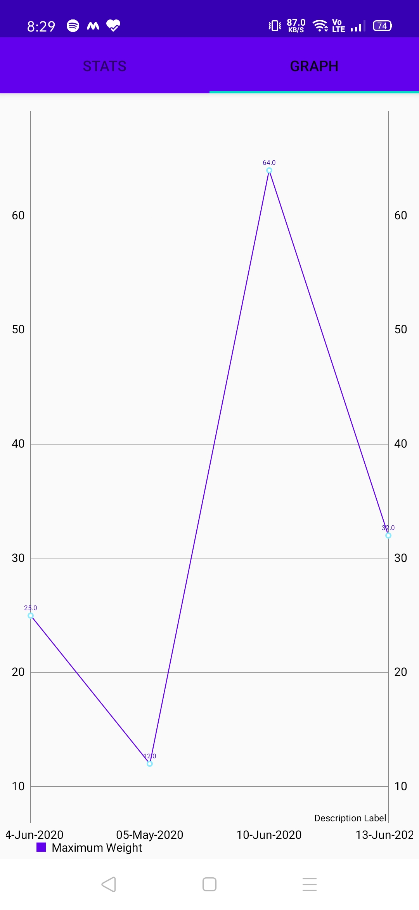
 
 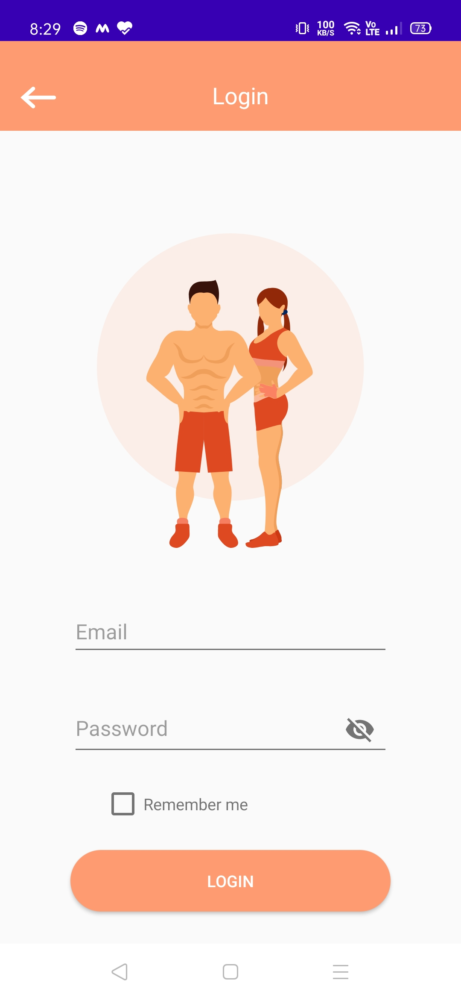
